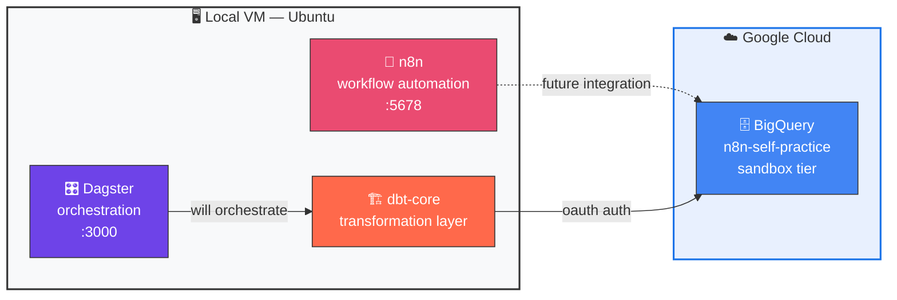
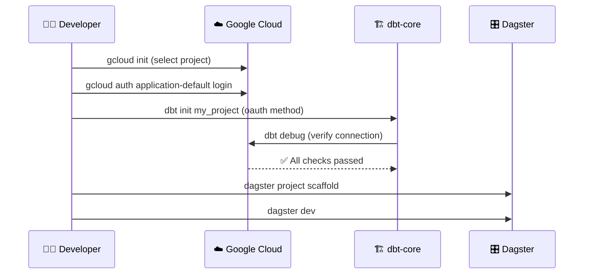
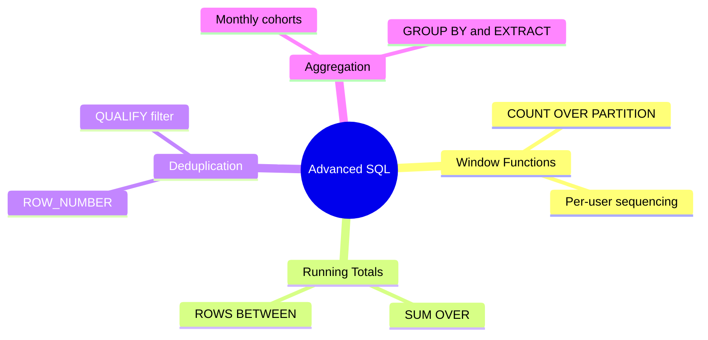
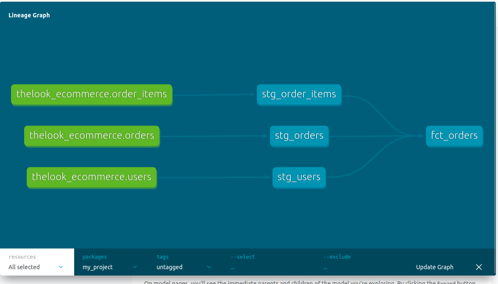
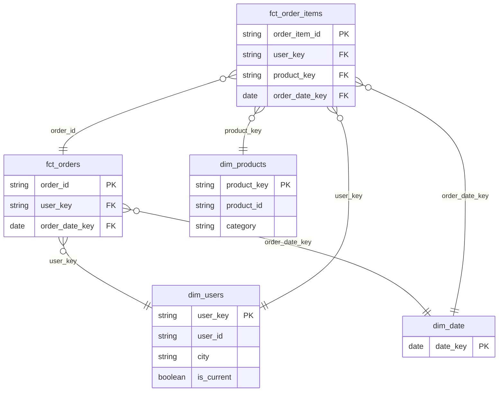

# Module 0 — Environment & Foundations
**n8n Data Platform Engineer — Skills Track**

Local-first setup connecting a self-hosted automation tool to a cloud data warehouse, an ELT transformation layer, and an orchestration layer — the four systems this track builds on.

---

## Architecture

---

## What's Working

| Component | Status | Verified By |
|---|---|---|
| 🔗 n8n | ✅ Running | Local Docker, `localhost:5678` reachable |
| ☁️ BigQuery auth | ✅ Connected | `gcloud auth application-default login` |
| 🏗️ dbt → BigQuery | ✅ Connected | `dbt debug` → All checks passed |
| 🎛️ Dagster | ✅ Running | `localhost:3000` webserver live |

---

## Setup Flow

1. `gcloud init` — authenticate CLI, select GCP project (`n8n-self-practice`)
2. `gcloud auth application-default login` — application-level credentials for dbt
3. Python venv created outside the dbt project folder (`~/n8n-practice/venv`)
4. `dbt init my_project` — oauth authentication method, no service account key needed (sandbox tier constraint)
5. `dbt debug` — confirms warehouse connection
6. `dagster project scaffold` + `dagster dev` — orchestration layer running, not yet wired to any real asset

---

## 🔍 Self-Check: Tested vs Assumed

**✅ Tested:**
- [x] dbt connects to BigQuery and passes all debug checks
- [x] n8n workflow persists after container restart (Docker volume mount confirmed)
- [x] Dagster webserver serves UI on `localhost:3000`
- [x] Service account/OAuth scope limited to sandbox project — no billing account attached

**⚠️ Assumed (not yet tested):**
- [ ] Behavior once real data volume exceeds sandbox free-tier limits
- [ ] Dagster-to-dbt integration (`dagster-dbt`) — install confirmed, integration not yet wired
- [ ] n8n-to-BigQuery direct integration — not yet attempted

---

## ➡️ Next Module
**Module 1 — Advanced SQL for Analytics Engineering** — window functions, CTEs, and incremental-query patterns against a public BigQuery dataset.

---

# Module 1 — Advanced SQL for Analytics Engineering

Practiced against `bigquery-public-data.thelook_ecommerce.orders` — a public e-commerce dataset. Full queries in `sql/module1_advanced_sql.sql`.

## Concepts Covered

## Query Summary

| # | Concept | What It Solves |
|---|---|---|
| 1 | Basic exploration | Understand raw table shape and columns |
| 2 | Window function COUNT OVER | Number each user's orders in sequence |
| 3 | Running total SUM OVER | Cumulative items ordered per user, over time |
| 4 | Dedup ROW_NUMBER plus QUALIFY | Isolate latest order per user, reused in dbt staging models |
| 5 | Monthly aggregation | Cohort-style breakdown by year, month, status |

## Self-Check: Tested vs Assumed

Tested:
- [x] All 5 queries return correct, verified results against the public dataset
- [x] QUALIFY correctly filters window function output, not possible with plain WHERE
- [x] Running total values manually spot-checked against raw num_of_item values

Assumed, not yet tested:
- [ ] Query performance and cost at production-scale row counts, millions plus rows
- [ ] Behavior with NULL values in partition or order columns, not encountered in this sample

## Next Module
**Module 2 — dbt Fundamentals on BigQuery** — staging and marts models, first working ELT pipeline.

---

# Module 2 — dbt Fundamentals on BigQuery

First working ELT pipeline: raw BigQuery public data transformed through staging into a business-ready mart table.

## Pipeline Lineage

## Models Built

| Layer | Model | Purpose |
|---|---|---|
| Staging | stg_orders | Cleaned order records from raw source |
| Staging | stg_users | Cleaned user records from raw source |
| Staging | stg_order_items | Cleaned order line items from raw source |
| Mart | fct_orders | Joined, business-ready order fact table with total value |

## Self-Check: Tested vs Assumed

Tested:
- [x] All 3 staging models build successfully as views
- [x] fct_orders correctly joins staging models via ref, dbt-managed dependency graph
- [x] 13 of 13 data tests pass, unique and not_null on key columns
- [x] Lineage graph confirms correct dependency order

Assumed, not yet tested:
- [ ] Incremental materialization, all models are full-refresh views so far
- [ ] Behavior on schema drift if source table columns change

## Next Module
**Module 3 — Data Modeling: Dimensional Design** — star schema and SCD Type 2 snapshots.

---

# Module 3 — Data Modeling: Dimensional Design

Star schema built on top of Module 2's staging layer, with SCD Type 2 change tracking via dbt snapshots.

## Star Schema

## Models Built

| Layer | Model | Purpose |
|---|---|---|
| Snapshot | users_snapshot | SCD Type 2 change tracking on users (check strategy) |
| Dimension | dim_users | Surrogate key, current + historical user attributes |
| Dimension | dim_products | Surrogate key, static product attributes |
| Dimension | dim_date | Calendar spine, 2019–2026 |
| Fact | fct_orders | Order grain — 1 row per order |
| Fact | fct_order_items | Line-item grain — 1 row per order item, carries product_key |

## Design Decisions

- **fct_orders vs fct_order_items split**: an order can contain multiple products, so `product_key` cannot live on the order-grain fact without breaking grain. Product-level analysis goes through `fct_order_items` instead.
- **SCD2 fan-out guard**: joins from fact tables to `dim_users` filter on `is_current = true` to prevent duplicate rows if a user's tracked attributes ever change.
- **check strategy over timestamp**: source table has no `updated_at` column, so snapshot uses `check_cols` on the fields most likely to change (address, traffic_source) rather than a blanket column check.

## Self-Check: Tested vs Assumed

Tested:
- [x] Snapshot correctly captures dbt_valid_from/dbt_valid_to on first run
- [x] Found and fixed a source data-quality issue — city column held the literal string "null" for ~5% of Brazil rows, silently bypassing IS NULL checks
- [x] All fact-to-dimension joins verified for null foreign keys (0 nulls on user_key, product_key, date_key)
- [x] 19 of 19 data tests pass across staging, dimensions, and facts

Assumed, not yet tested:
- [ ] SCD2 behavior on an actual attribute change — source data is static, so a second snapshot run producing a new row version hasn't been observed yet
- [ ] dim_date coverage beyond 2026 if the source data range extends further

## Next Module
**Module 4** — TBD
