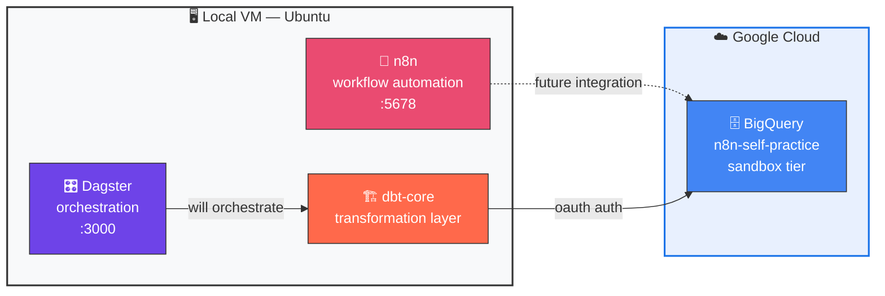
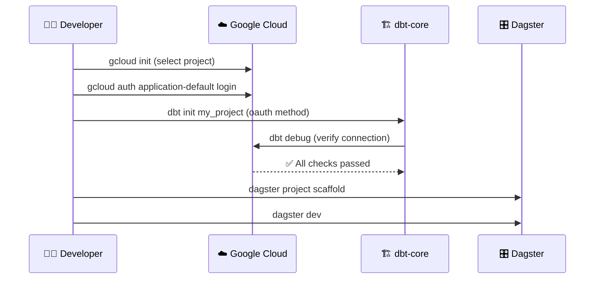

# Module 0 — Environment & Foundations
**n8n Data Platform Engineer — Skills Track**

Local-first setup connecting a self-hosted automation tool to a cloud data warehouse, an ELT transformation layer, and an orchestration layer — the four systems this track builds on.

---

## Architecture

---

## What's Working

| Component | Status | Verified By |
|---|---|---|
| 🔗 n8n | ✅ Running | Local Docker, `localhost:5678` reachable |
| ☁️ BigQuery auth | ✅ Connected | `gcloud auth application-default login` |
| 🏗️ dbt → BigQuery | ✅ Connected | `dbt debug` → All checks passed |
| 🎛️ Dagster | ✅ Running | `localhost:3000` webserver live |

---

## Setup Flow

1. `gcloud init` — authenticate CLI, select GCP project (`n8n-self-practice`)
2. `gcloud auth application-default login` — application-level credentials for dbt
3. Python venv created outside the dbt project folder (`~/n8n-practice/venv`)
4. `dbt init my_project` — oauth authentication method, no service account key needed (sandbox tier constraint)
5. `dbt debug` — confirms warehouse connection
6. `dagster project scaffold` + `dagster dev` — orchestration layer running, not yet wired to any real asset

---

## 🔍 Self-Check: Tested vs Assumed

**✅ Tested:**
- [x] dbt connects to BigQuery and passes all debug checks
- [x] n8n workflow persists after container restart (Docker volume mount confirmed)
- [x] Dagster webserver serves UI on `localhost:3000`
- [x] Service account/OAuth scope limited to sandbox project — no billing account attached

**⚠️ Assumed (not yet tested):**
- [ ] Behavior once real data volume exceeds sandbox free-tier limits
- [ ] Dagster-to-dbt integration (`dagster-dbt`) — install confirmed, integration not yet wired
- [ ] n8n-to-BigQuery direct integration — not yet attempted

---

## ➡️ Next Module
**Module 1 — Advanced SQL for Analytics Engineering** — window functions, CTEs, and incremental-query patterns against a public BigQuery dataset.
